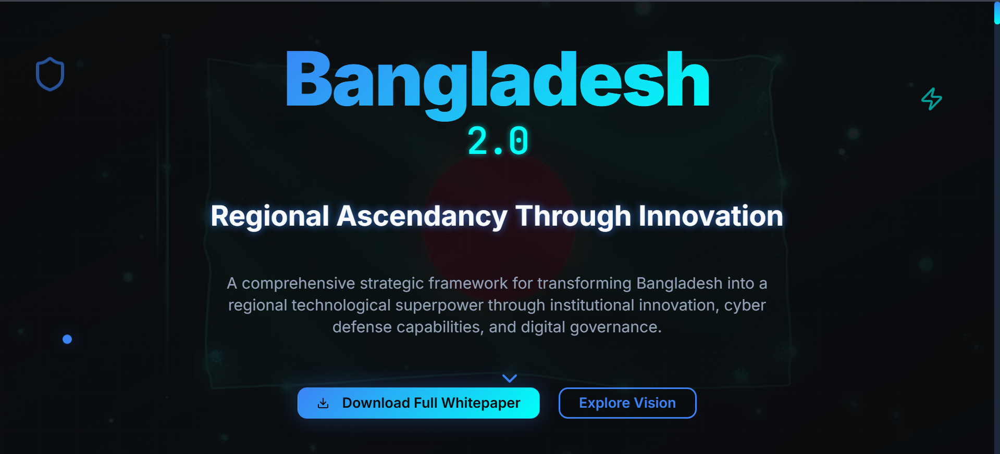

<h1 align="center">🛡️ Bengal Cyber Nexus</h1>
<p align="center"><strong>Bangladesh 2.0 – Regional Ascendancy Through Innovation</strong></p>
<p align="center">A next-gen modular UI framework designed for civic-tech platforms, AI-driven governance, and national digital infrastructure.</p>

---

## 🚀 What is Bengal Cyber Nexus?

A futuristic, cyberpunk-inspired interface engine built with **Vite + React**, optimized for:

- 🌐 **Civic dashboards**
- 🧠 **AI interfaces**
- 🏛️ **Digital governance**
- 🧩 **Modular public infrastructure**

This project is a **bold vision to reimagine Digital Bangladesh** as a technological superpower across South Asia.

---

## 🎯 Key Features

✅ Scalable component-based architecture (React + Vite)  
✅ Built-in dark mode & responsive grid layout  
✅ Civic-tech, defense & governance inspired UX  
✅ Accessible, minimalist, and performance-first  
✅ Cyberpunk aesthetics with strategic typography

---

## 🖼️ Live Interface Preview

### 📸 Screenshot  



### 🌐 Preview Link
**[➡️ Click Here to View Live Project](https://bengal-cyber-nexus.vercel.app/)**

---

## 🧪 Quick Start Guide

Clone, install, and run like a boss:

```bash
# 🔁 Clone the repo
git clone https://github.com/your-username/bengal-cyber-nexus.git
cd bengal-cyber-nexus

# 📦 Install dependencies
npm install

# ⚙️ Start dev server
npm run dev
